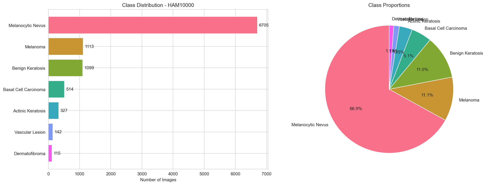
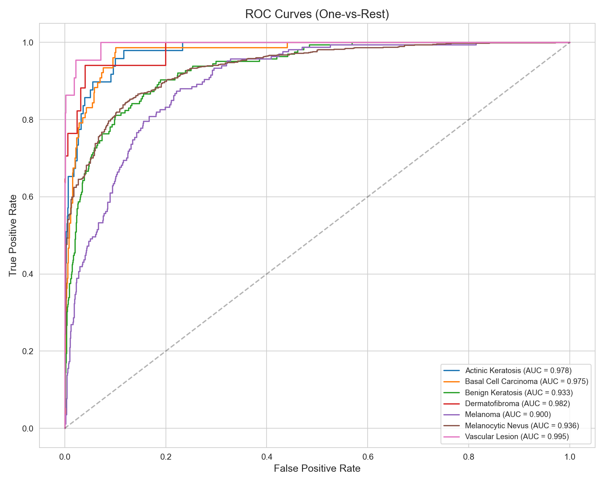

# SkinVision

**Deep Learning for Skin Condition Detection**

[](https://python.org)
[](https://pytorch.org)
[](LICENSE)

> A computer vision project that classifies dermatoscopic images into 7 skin lesion categories using transfer learning, with Grad-CAM explainability and an interactive web demo.

> **Disclaimer:** This is an educational project, NOT a medical diagnostic tool. Always consult a dermatologist for real diagnosis.

---

<!-- TODO: Add demo GIF here once the app is built -->
<!--  -->

## Overview

SkinVision takes a skin lesion image and:
1. **Classifies** it into one of 7 diagnostic categories
2. **Explains** its decision using Grad-CAM heatmaps
3. **Reports** confidence scores for each possible condition

### Detected Conditions

| Condition | Code | Description |
|-----------|------|-------------|
| Actinic Keratosis | `akiec` | Pre-cancerous rough patches from sun damage |
| Basal Cell Carcinoma | `bcc` | Most common skin cancer |
| Benign Keratosis | `bkl` | Non-cancerous growths |
| Dermatofibroma | `df` | Harmless firm bumps |
| Melanoma | `mel` | Most dangerous skin cancer |
| Melanocytic Nevus | `nv` | Common moles (usually benign) |
| Vascular Lesion | `vasc` | Blood vessel-related marks |

---

## Results

<!-- TODO: Fill in actual metrics after training -->

### Model Comparison

| Model | Accuracy | F1 (macro) | AUC-ROC | Parameters | Inference |
|-------|----------|------------|---------|------------|-----------|
| EfficientNet-B3 | — | — | — | 12M | — |
| ResNet50 | — | — | — | 25M | — |

### Visualizations

<!-- TODO: Add these images after running the notebooks -->
<!--
| Class Distribution | Confusion Matrix | ROC Curves |
|---|---|---|
|  |  |  |
-->

### Grad-CAM Explainability

<!-- TODO: Add Grad-CAM samples -->
<!--  -->

---

## Project Structure

```
SkinVision/
├── README.md                        # You are here
├── The_plan.md                      # Detailed project plan
├── requirements.txt                 # Dependencies
├── .gitignore
│
├── notebooks/
│   ├── 01_data_exploration.ipynb    # EDA — class distribution, samples, stats
│   ├── 02_model_training.ipynb      # Transfer learning + training
│   ├── 03_evaluation.ipynb          # Metrics, confusion matrix, ROC curves
│   └── 04_gradcam.ipynb             # Explainability visualizations
│
├── src/
│   ├── config.py                    # All paths + hyperparameters
│   ├── dataset.py                   # PyTorch Dataset + DataLoaders
│   ├── model.py                     # Model creation (EfficientNet/ResNet)
│   ├── train.py                     # Training loop with early stopping
│   ├── evaluate.py                  # Metrics + visualization
│   ├── gradcam.py                   # Grad-CAM implementation
│   └── preprocessing.py             # Image preprocessing utilities
│
├── app/
│   └── app.py                       # Streamlit web demo
│
├── data/HAM10000/                   # Dataset (not in git)
├── models/                          # Saved weights (not in git)
└── results/                         # Generated charts and figures
```

## Quick Start

### 1. Clone & Install

```bash
git clone https://github.com/YOUR_USERNAME/SkinVision.git
cd SkinVision
pip install -r requirements.txt
```

### 2. Get the Data

Download **HAM10000** from Kaggle ("Skin Cancer MNIST: HAM10000") and extract into `data/HAM10000/`.

### 3. Explore

Open `notebooks/01_data_exploration.ipynb` and run all cells.

### 4. Train

Open `notebooks/02_model_training.ipynb` or run:

```bash
# Coming soon — CLI training script
```

### 5. Demo App

```bash
streamlit run app/app.py
```

---

## Dataset

**HAM10000** (Human Against Machine with 10000 training images)
- 10,015 dermatoscopic images
- 7 diagnostic categories
- Collected over 20 years from two sites
- Published metadata: age, sex, body location

---

## Tech Stack

| Component | Tool |
|-----------|------|
| Framework | PyTorch |
| Pretrained Models | timm (EfficientNet-B3, ResNet50) |
| Augmentation | albumentations |
| Explainability | Grad-CAM |
| Evaluation | scikit-learn |
| Visualization | Matplotlib, Seaborn, Plotly |
| Web App | Streamlit |
| Experiment Tracking | Weights & Biases |

---

## What I Learned

- Image classification with CNNs and transfer learning
- Handling class imbalance in medical datasets
- Data augmentation strategies for small datasets
- Model evaluation beyond accuracy (precision, recall, F1, AUC-ROC)
- Explainable AI with Grad-CAM
- Building and deploying ML web applications
- Ethical considerations in health AI (bias, fairness, disclaimers)

---

## Acknowledgments

- [HAM10000 Dataset](https://dataverse.harvard.edu/dataset.xhtml?persistentId=doi:10.7910/DVN/DBW86T) — Tschandl et al.
- [VolleyVision](https://github.com/shukkkur/VolleyVision) — Inspiration for applying CV to a real-world domain
- [timm](https://github.com/huggingface/pytorch-image-models) — PyTorch Image Models

---

## License

MIT License — see [LICENSE](LICENSE) for details.
