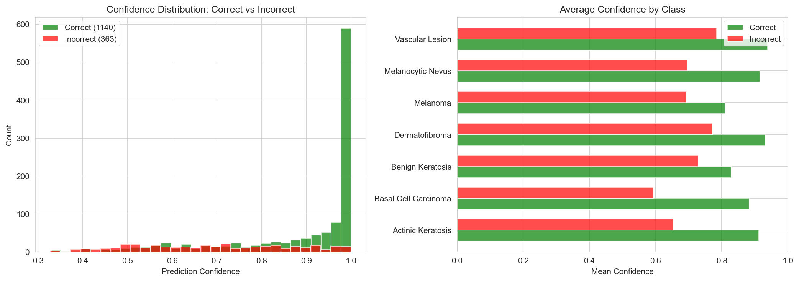
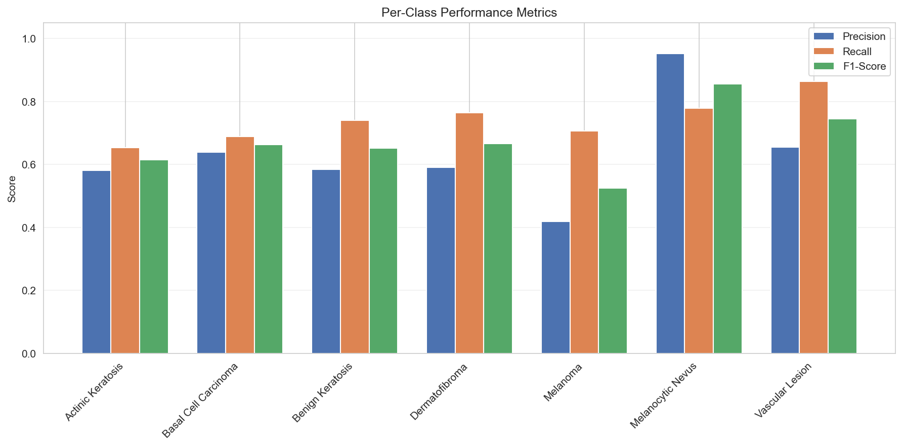
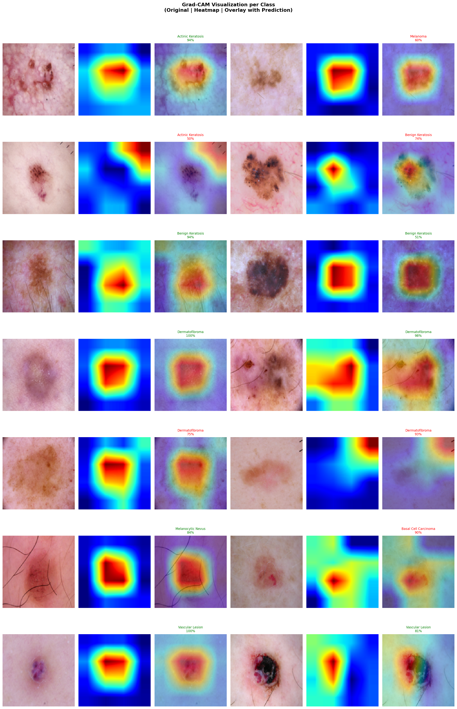
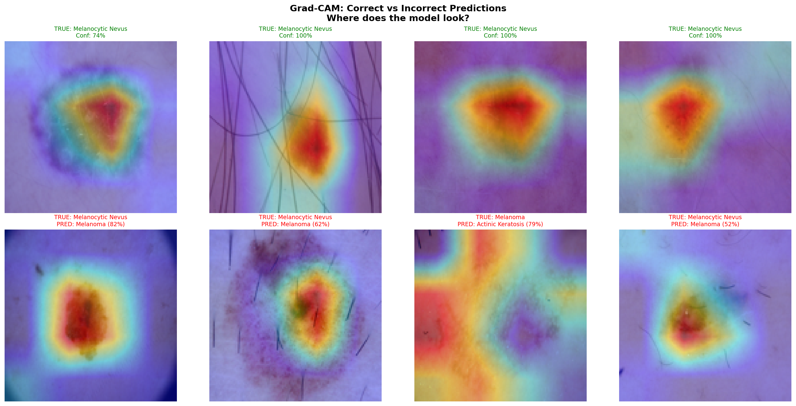

# SkinVision

**Deep Learning for Skin Condition Detection**

[](https://python.org)
[](https://pytorch.org)
[](LICENSE)

> Classifies dermatoscopic images into 7 skin lesion categories using transfer learning (EfficientNet-B0), with Grad-CAM explainability and an interactive Gradio demo.

> **Disclaimer:** This is an educational project, NOT a medical diagnostic tool. Always consult a dermatologist.

---

## Results

| Metric | Value |
|--------|-------|
| **Test Accuracy** | 75.8% |
| **Best Val Accuracy** | 77.3% |
| **Mean AUC-ROC** | 0.957 |
| **Macro F1** | 0.67 |
| **Weighted F1** | 0.78 |
| **Parameters** | 4M (EfficientNet-B0) |

### Visualizations

| Class Distribution | Confusion Matrix | Training Curves |
|---|---|---|
|  |  |  |

| ROC Curves | Confidence Analysis | Per-Class Metrics |
|---|---|---|
|  |  |  |

### Grad-CAM Explainability

| Per Class | Correct vs Incorrect |
|---|---|
|  |  |

---

## Detected Conditions

| Condition | Code | Description |
|-----------|------|-------------|
| Actinic Keratosis | `akiec` | Pre-cancerous rough patches from sun damage |
| Basal Cell Carcinoma | `bcc` | Most common skin cancer |
| Benign Keratosis | `bkl` | Non-cancerous growths |
| Dermatofibroma | `df` | Harmless firm bumps |
| Melanoma | `mel` | Most dangerous skin cancer |
| Melanocytic Nevus | `nv` | Common moles (usually benign) |
| Vascular Lesion | `vasc` | Blood vessel-related marks |

---

## Project Structure

```
SkinVision/
├── notebooks/
│   ├── 01_data_exploration.ipynb    # EDA — class distribution, samples, stats
│   ├── 02_model_training.ipynb      # Transfer learning + two-phase training
│   ├── 03_evaluation.ipynb          # ROC curves, confidence, error analysis
│   └── 04_gradcam.ipynb             # Grad-CAM explainability heatmaps
│
├── src/
│   ├── config.py                    # Paths + hyperparameters
│   ├── dataset.py                   # PyTorch Dataset + augmentation
│   ├── model.py                     # EfficientNet wrapper (timm)
│   ├── train.py                     # Training loop + early stopping
│   ├── evaluate.py                  # Metrics + visualization
│   ├── gradcam.py                   # Grad-CAM implementation
│   └── preprocessing.py             # Image preprocessing
│
├── app/
│   └── app.py                       # Gradio web demo
│
├── data/HAM10000/                   # Dataset (not in git)
├── models/                          # Saved weights (not in git)
└── results/                         # Generated charts
```

## Quick Start

### 1. Clone & Install

```bash
git clone https://github.com/kitsakisGk/SkinVision.git
cd SkinVision
pip install -r requirements.txt
```

### 2. Get the Data

Download **HAM10000** from Kaggle ("Skin Cancer MNIST: HAM10000") and extract into `data/HAM10000/`.

### 3. Run Notebooks

```bash
# Run in order:
notebooks/01_data_exploration.ipynb
notebooks/02_model_training.ipynb
notebooks/03_evaluation.ipynb
notebooks/04_gradcam.ipynb
```

### 4. Demo App

```bash
python app/app.py
```

---

## Tech Stack

| Component | Tool |
|-----------|------|
| Framework | PyTorch |
| Pretrained Models | timm (EfficientNet-B0) |
| Augmentation | albumentations |
| Explainability | Grad-CAM |
| Evaluation | scikit-learn |
| Visualization | Matplotlib, Seaborn |
| Web App | Gradio |

---

## What I Learned

- Transfer learning with EfficientNet (two-phase: head → full fine-tuning)
- Handling class imbalance with weighted loss + stratified splits
- Data augmentation for small medical datasets
- Model evaluation beyond accuracy (precision, recall, F1, AUC-ROC)
- Explainable AI with Grad-CAM
- Building and deploying ML web applications

---

## Dataset

**HAM10000** (Human Against Machine with 10000 training images)
- 10,015 dermatoscopic images, 7 diagnostic categories
- Collected over 20 years from two clinical sites
- Published metadata: age, sex, body location
- [Source](https://dataverse.harvard.edu/dataset.xhtml?persistentId=doi:10.7910/DVN/DBW86T) — Tschandl et al.

---

## Acknowledgments

- [VolleyVision](https://github.com/shukkkur/VolleyVision) — Inspiration for applying CV to a real-world domain
- [timm](https://github.com/huggingface/pytorch-image-models) — PyTorch Image Models

---

## License

MIT License
